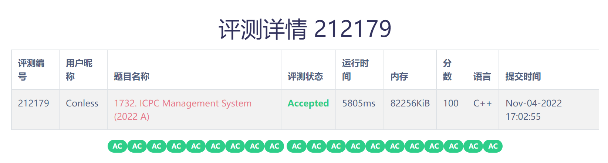

# ICPC Management System

该项目为上海交通大学致远学院 ACM 班第二次大作业, 笔者在助教和同学的帮助中完成了全部代码, 下面简单介绍实现思路.

大作业地址: https://github.com/ACMClassCourse-2022/ICPC-Management-System-2022

代码实现: https://github.com/Conless/HW2-ICPC-Management-System-2022

## 完成情况

## 一些疑惑

感觉空间常数还是太大, 不知道有哪些可以释放的内容.

updated on 221104

---

## 算法思路

首先, 对于队伍数据, 用两个 vector 数组存储, 分别记录队伍直到上一次封榜/刷新榜单前的数据与实时数据, 包括了队伍名称, 队伍对于每一题的提交次数, 正确提交前的提交次数, 通过题目的数量, 对于每一道题的通过时间, 对于每一个题目每一个状态的最后一次提交. 还有其在封榜之后进行的操作, 包括了封榜后队伍对每一题的提交次数, 正确提交前的提交次数, 通过题目的数量, 对于每一题的通过时间, 对于每一个题目每一个状态的最后一次提交.

接下来, 用一个 unordered_map 建立从队伍名到队伍编号的映射.

用两个 set 管理队伍的实时排名.

添加队伍时, 将每一支队伍依次添加到两个 vector, unordered_map 与 set 中, 最坏时间复杂度为 set 添加的 O(logn).

提交题目时, 如果此时不处于封榜状态, 将提交信息添加到实时队伍数据的 vector 中, 然后对实时数据的 set 进行先删除后插入的操作. 如果此时处于封榜状态, 将提交信息添加到实时队伍数据的 vector 的封榜信息中, 不用操作 set. 最坏时间复杂度为 set 删除添加的 O(logn).

刷新榜单时, 直接将储存实时数据的 vector 和 set 拷贝给储存上一次数据的结构, 同时, 从 set.begin() 开始, 更新每一支队伍的排名数据, 总时间复杂度为 O(n).

封榜时, 将封榜的标记标为 true 即可.

滚榜时, 首先, 对于原始 set, 直接取出 --set.end(), 然后据此找到其在实时 vector 中的位置, 进行更新即可. 理论最坏时间复杂度为 O(nlogn) (最大常数 m)

查询队伍排名时, 直接从 unordered_map 中取数即可, 时间复杂度为 O(1).

查询队伍提交情况时, 直接从队伍信息中提取最后一次提交即可, 时间复杂度为 O(1).

## 项目架构

- include
  - resource.h
  - data.h
  - ICPC.h
- src
  - main.cpp
  - data.cc
  - ICPC.cc

## 项目进度

完成整个管理系统, 所需要的主干信息为每支队伍的信息 

需要实现的接口有

- resource.h                       √ 221101
  - 输入判断信息                   
  - 提交状态记号                

- data.h/ .cc                      √ 221101
  - class Submission
    - tid, pid, status, tim, subid
    - constructor
    - compare
  - class SubmitData
    - ac_count, submit_count, submit_before_ac_count
    - ac_time
    - las_submit[4]
    - constructor
  - class TeamData
    - team_name, rank, penalty (public)
    - tid, ac_time_ordered
    - submission, submission_after_frozen
    - constructor
    - judge ac/frozen
    - get last submit
    - submit a problem
    - output the data

- ICPC.h/ .cc                       √ 221102
  - struct InputMessage
  - Input() & JudgeInput()
  - class CompareTeam()
  - OperateMsg()
    - AddTeam()
    - StartCompetition()
    - SubmitProblem()
    - FlushBoard()
    - FreezeBoard()
    - OutputData()
    - ScrollBoard()
    - QueryRanking()
    - QuerySubmission()

update on 221102